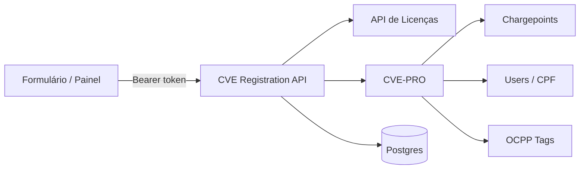

# CVE Registration API

<p align="center">
  <strong>API em Go que orquestra o cadastro de carregadores elétricos</strong><br/>
  Licenças → CVE-PRO → RFID → Postgres — em um único fluxo autenticado.
</p>

<p align="center">
  
  
  
  
</p>

---

## O que é

Backend do formulário de **cadastro de carregadores** (CVE / Intelbras). Em uma única chamada autenticada, a API:

1. Valida ou resolve a **licença** na API de Licenças  
2. Cadastra o **chargepoint** na CVE-PRO  
3. Vincula **usuários** (estações privadas)  
4. Registra **tags RFID**, se solicitado  
5. Persiste o resultado no **Postgres** para busca e atuação manual

Ideal para o painel operacional e o front do formulário React.

---

## Fluxo de orquestração



| Etapa | O que acontece |
|-------|----------------|
| **1. Licença** | Usa `license_code` (ex.: `P3D-…`, `12M-…`) ou busca licença disponível pelo e-mail |
| **2. Bind (private)** | Resolve `user_pk` via CPF/e-mail e monta `bindUsers` |
| **3. Chargepoint** | `POST /api/v1/chargepoints` com endereço, geo, agenda e tenant |
| **4. RFID** | Opcional — cria tags OCPP (`CARD`) por código |
| **5. Persistência** | Status `pending` → `success` ou `error` (com mensagem para o painel) |

Falhas intermediárias **não somem**: o registro fica com `status=error` e `registration_id` na resposta `422`, pronto para correção manual.

---

## Stack

| Camada | Tecnologia |
|--------|------------|
| Runtime | Go **1.22** |
| HTTP | `net/http` (stdlib) |
| Banco | PostgreSQL + `lib/pq` |
| Auth painel | Token HMAC-SHA256 (8h) + bcrypt |
| Config | `.env` via `godotenv` |
| Deploy | Docker multi-stage + Compose |
| Migrations | SQL embutido — aplicadas na subida |

---

## Estrutura do projeto

```text
cve-registration-api/
├── cmd/
│   ├── api/                 # ponto de entrada HTTP
│   └── hashpassword/        # utilitário bcrypt (cadastro manual)
├── internal/
│   ├── auth/                # emissão/validação de tokens do painel
│   ├── config/              # carga e validação do .env
│   ├── cveclient/           # cliente HTTP CVE-PRO
│   ├── licenseclient/       # cliente HTTP API de Licenças
│   ├── domain/              # modelos (form, chargepoint, licença…)
│   ├── handler/             # handlers HTTP
│   ├── repository/          # Postgres (solicitações + usuários)
│   ├── service/             # orquestração do fluxo completo
│   └── migrate/             # runner de migrations
├── migrations/              # 001_init.sql, 002_panel_users_enabled.sql
├── postman/                 # collection pronta para importar
├── Dockerfile
├── docker-compose.yml
└── .env.example
```

---

## Quick start

### Pré-requisitos

- Go **1.22+**
- PostgreSQL acessível (o Compose **não** sobe o banco)
- Credenciais CVE-PRO + API de Licenças

### 1. Ambiente

```bash
cp .env.example .env
```

Preencha as variáveis obrigatórias (veja a tabela abaixo).

> **Docker tip:** se a API rodar em container, não use `localhost` no `DATABASE_URL` — use o IP do host ou `host.docker.internal`.

### 2. Subir localmente

```bash
go mod tidy
go run ./cmd/api
```

A API escuta em `http://localhost:8080` (ou `PORT` do `.env`).  
As migrations em `migrations/*.sql` rodam **automaticamente** na subida.

### 3. Produção (Docker)

```bash
docker compose up -d --build
```

---

## Variáveis de ambiente

| Variável | Obrigatória | Descrição |
|----------|:-----------:|-----------|
| `PORT` | | Porta HTTP (default `8080`) |
| `DATABASE_URL` | ✅ | Connection string Postgres |
| `CVE_BASE_URL` | | Base CVE-PRO (default ambiente de teste) |
| `CVE_API_KEY` | ✅ | API key CVE-PRO |
| `CVE_LOGIN_EMAIL` | ✅ | Login de serviço CVE |
| `CVE_LOGIN_PASSWORD` | ✅ | Senha de serviço CVE |
| `CVE_TENANT_PK` | ✅ | Tenant numérico |
| `LICENSE_BASE_URL` | | Base API de Licenças |
| `LICENSE_LOGIN_EMAIL` | ✅ | Login API de Licenças |
| `LICENSE_LOGIN_PASSWORD` | ✅ | Senha API de Licenças |
| `JWT_SECRET` | ✅ | Segredo longo e aleatório para tokens do painel |

---

## Autenticação do painel

O acesso ao formulário/painel é **independente** dos logins CVE e Licenças.

```text
POST /auth/register  →  usuário criado com enabled=false
         ↓
UPDATE panel_users SET enabled = true WHERE email = '...';
         ↓
POST /auth/login     →  { "token": "..." }  (válido por 8h)
         ↓
Authorization: Bearer <token>
```

**Alternativa manual** (hash bcrypt):

```bash
go run ./cmd/hashpassword "sua-senha-forte"

psql "$DATABASE_URL" -c "
  INSERT INTO panel_users (email, password_hash, enabled)
  VALUES ('voce@empresa.com', '<hash>', true);
"
```

---

## API

Todas as rotas de negócio exigem `Authorization: Bearer <token>`, exceto registro/login.

| Método | Rota | Descrição |
|--------|------|-----------|
| `POST` | `/auth/register` | Cria usuário do painel (aguarda liberação) |
| `POST` | `/auth/login` | Retorna token |
| `POST` | `/registrations` | Executa o fluxo completo de cadastro |
| `GET` | `/registrations?q=` | Busca por nome, e-mail, serial ou status |
| `GET` | `/users/by-cpf/{cpf}` | Resolve `user_pk` para estações **private** |

### Status de cadastro

| Status | Significado |
|--------|-------------|
| `pending` | Solicitação criada, fluxo em andamento |
| `success` | Chargepoint (e tags, se houver) ok |
| `error` | Falha — veja `error_message` / resposta `422` |

### Respostas úteis

**Sucesso** — `200`

```json
{ "message": "cadastrado com sucesso" }
```

**Falha de orquestração** — `422` (registro já persistido)

```json
{
  "error": "motivo da falha",
  "registration_id": 42
}
```

### Payload (visão geral)

Campos principais do `RegistrationForm`:

```json
{
  "first_name": "João",
  "last_name": "Silva",
  "email": "joao@email.com",
  "serial_number": "SN1234567890",
  "visibility": "public",
  "available_24h": false,
  "available_from": "08:00",
  "available_to": "18:00",
  "license_code": "P3D-...",
  "latitude": -27.5954,
  "longitude": -48.5480,
  "authorized_users": [],
  "wants_rfid_tag": false,
  "rfid_codes": []
}
```

**Regras importantes**

- `license_code` deve ser o código da licença (`P3D-…` / `12M-…`), **nunca** a chave `CVE-…`
- `visibility=private` exige `authorized_users` com `user_pk` (use `GET /users/by-cpf/{cpf}`)
- Lat/long vêm do front (ViaCEP + geocoder) — o backend só persiste e repassa
- Horário `HH:MM` é normalizado para `HH:MM:SS` antes de ir à CVE (`schedule_type=CUSTOM`)

---

## Collection Postman

Importe [`postman/CVE-Registration-API.postman_collection.json`](postman/CVE-Registration-API.postman_collection.json).

Fluxo sugerido:

1. **Registrar** → liberar no banco  
2. **Login** → token salvo na variável `token`  
3. (Private) **Buscar usuário por CPF** → copiar `user_pk`  
4. **Criar cadastro** / **Buscar cadastros**

Variáveis da collection: `base_url` (default `http://localhost:8080`) e `token`.

---

## Banco de dados

Tabelas principais:

- **`panel_users`** — operadores do painel (`enabled` controla o acesso)
- **`charger_registrations`** — histórico de solicitações (`form_data` em JSONB + status/resultado)
- **`schema_migrations`** — controle automático de migrations

Índices em e-mail, número de série e status para busca rápida no painel.

---

## Integrações externas

| Sistema | Papel |
|---------|--------|
| [CVE-PRO](https://cs-test.intelbras-cve-pro.com.br) | Chargepoints, usuários, tags OCPP |
| [API de Licenças](https://api-licenca.intelbras-cve-pro.com.br) | Login, busca e validação de licenças |

Os clients em `internal/cveclient` e `internal/licenseclient` cuidam de login, retries e mapeamento de payloads.

---

## Desenvolvimento

```bash
# Dependências
go mod tidy

# API
go run ./cmd/api

# Hash de senha
go run ./cmd/hashpassword "senha"

# Build de produção (igual ao Docker)
CGO_ENABLED=0 go build -trimpath -ldflags="-s -w" -o api ./cmd/api
```

---

<p align="center">
  <sub>Feito para o ecossistema CVE · Cadastro de carregadores Intelbras</sub>
</p>
